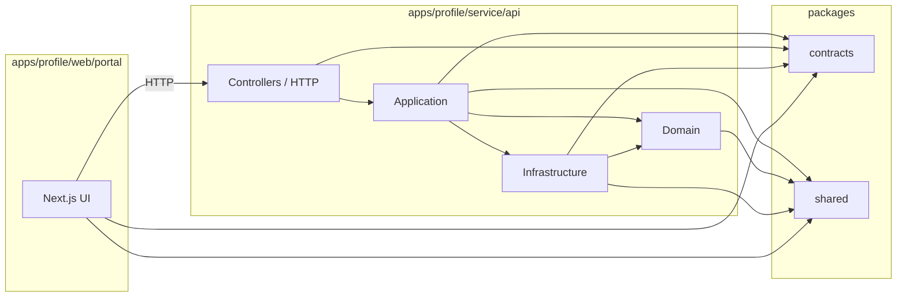

# ADR-013: Monorepo Client/Server Split

**Date:** 2026-09-07
**Status:** Proposed

## Context

The current repository behaves like a client application with some server-side routes embedded in Next.js. That works for transition, but it mixes concerns:

- the browser-facing app is acting as the UI client
- some routes are talking directly to the database
- some content is already falling back to static JSON snapshots
- the real backend boundary is not explicit

From the perspective of a web client, external data access should be modeled as HTTP calls to a backend service. The client should not depend on direct database access or database-specific adapters.

This ADR defines the target split for the product line so the web app stays a client, while a separate service owns persistence and business writes.

## Decision

Adopt a monorepo with explicit client/server boundaries:

```text
repo/
  apps/
    profile/
      web/portal/   # Next.js client
      service/api/  # NestJS backend
  packages/
    contracts/
    domain/
    application/
    infrastructure/
    shared/
```

The client (`web/portal`) talks to the backend (`service/api`) exclusively over HTTP.

The backend owns:

- domain rules
- use cases
- persistence adapters
- writes to databases and external services

The client owns:

- presentation
- client-side orchestration
- HTTP adapters
- UI-only state

## Dependency Rules

Allowed dependencies:

```text
web/portal  -> contracts, shared, ui (if present), config
service/api -> contracts, domain, application, infrastructure, shared, config

application -> domain, contracts, shared, config
infrastructure -> application, domain, contracts, shared, config
domain -> shared, config
contracts -> shared
```

Not allowed:

- `web/portal` importing DB clients or infrastructure adapters directly
- `domain` importing React, Next.js, or HTTP controllers
- `packages/*` depending on `apps/*`

## Dependency Diagram



## Consequences

Positive:

- The frontend remains a true client.
- DB access is isolated to the backend.
- Contracts become reusable between apps.
- Static fallback and dynamic backend modes become implementation details, not app-wide coupling.
- Domain boundaries become clearer for `profile`, `projects`, `articles`, and future services.

Trade-offs:

- More upfront structure.
- Need to maintain package boundaries carefully.
- Requires HTTP contract versioning or schema discipline.

## Migration Path

1. Freeze the current target boundaries.
2. Extract shared contracts for each domain.
3. Move profile read/write logic into a backend service first.
4. Point the Next app to the backend via HTTP adapters.
5. Repeat for projects and articles.
6. Keep static JSON only as a snapshot/read-only mode, not as the long-term application boundary.

## Notes

- This ADR does not require changing every domain immediately.
- The current Next.js app can keep transitional server routes until the backend exists.
- The intended end state is a client app that never depends on direct DB access.
